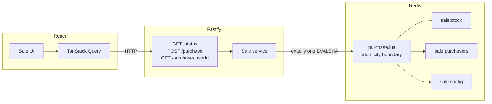

# Flash Sale System

A single-product flash sale: limited stock, a fixed window, one item per
user. The interesting part is the purchase path. When thousands of people
hit Buy at the same moment, the system must sell exactly the available
stock — not one more, not one fewer — and no user may acquire two.

The API is Fastify. The store is Redis, with every purchase decision
executed inside one Lua script so nothing can interleave. The frontend is
a single React screen that polls sale status and submits purchases.

## Prerequisites

- Node.js 22+
- npm 10+
- An [Upstash](https://upstash.com/) Redis database (REST URL + token)

## Setup

Copy `.env.example` to `.env` and fill in your Upstash REST credentials:

```bash
cp .env.example .env
```

```
UPSTASH_REDIS_REST_URL=https://your-db.upstash.io
UPSTASH_REDIS_REST_TOKEN=your-token
```

Those two values are what the Upstash console shows. The API turns them into a
`rediss://` connection so the purchase Lua script still runs atomically on
Redis — we do not use the REST HTTP API on the hot path.

```bash
npm install
npm run dev
```

The API listens on `http://localhost:3000` and the web app on
`http://localhost:5173`. Open the web URL, enter a user identifier such as
`you@example.com`, and click Buy. By default the sale window is already open.

To run the production build instead:

```bash
npm run start
```

That builds if needed, then starts the compiled API (`node dist/index.js`) and
serves the Vite production bundle (`vite preview`) on the same ports. You still
need Upstash credentials in `.env`.

Do not commit `.env`. If `REDIS_URL` is set, it wins over the Upstash pair.

Set `RESEED_ON_BOOT=false` if a restart must not reset a sale in progress.

## Commands

| What                     | Command                                |
| ------------------------ | -------------------------------------- |
| API + web (dev)          | `npm run dev`                          |
| Production build         | `npm run build`                        |
| API + web (production)   | `npm run start`                        |
| API only (dev)           | `npm run dev -w @flash-sale/api`       |
| Web only (dev)           | `npm run dev -w @flash-sale/web`       |
| Unit + integration tests | `npm test` (uses Upstash from `.env`)  |
| Stress test              | `npm run stress` (API must be running) |
| Lint                     | `npm run lint`                         |
| Format check             | `npm run format:check`                 |

Health check: `GET http://localhost:3000/health` →
`{"status":"ok","redis":"connected"}`.

## Architecture



The React app never talks to Redis. Status polling and the purchase
mutation go through the API. `POST /purchase` does **not** read stock
first and then write; it sends the user id and a server timestamp into
the Lua script and maps the script's result code to HTTP. That single
round trip is the atomicity boundary.

Redis keys:

| Key               | Type    | Role                                                           |
| ----------------- | ------- | -------------------------------------------------------------- |
| `sale:config`     | hash    | `startTime`, `endTime` (epoch ms), `totalStock`                |
| `sale:stock`      | integer | Remaining units                                                |
| `sale:purchasers` | set     | User ids who secured an item; also the "did I get one?" lookup |

## Design choices and trade-offs

**Fastify over Express, Nest, or native `http`.** The brief is about
throughput on a tiny surface area. Fastify's routing and JSON
serialization are faster than Express, and JSON schemas give us request
validation plus faster serialization on the hot path. Nest would be a
module-and-decorator framework for three endpoints. Native `http` would
spend the same afternoon on body parsing and CORS.

**Redis as the only store, hosted on Upstash.** Stock and purchaser identity
have to be mutated together under contention. A relational `SELECT` then
`UPDATE` recreates the race Redis is there to close. Upstash is still Redis —
the Lua script is the source of truth — with their replication instead of a
local AOF file. We connect with ioredis over TLS (`rediss://`), not the REST
SDK, so `EVALSHA` stays one Redis round trip. In production I would still
write completed orders asynchronously to a relational store so order history
survives independently of the cache tier and can be queried without touching
the hot path. That write would happen _after_ the Lua script returns success,
never in the decision path.

**Server-supplied timestamp, not `redis.call('TIME')`.** The script
receives `now` from the API. Tests can freeze the clock by seeding a
window around a known time, and the script stays deterministic. The
cost is that multiple API instances need reasonably aligned clocks. For
a local take-home that is the right trade; a production cluster would
either NTP-sync or switch the script to Redis server time.

**Fail closed if Redis is unreachable.** A purchase that cannot talk to
Redis returns 503. There is no in-memory fallback. Overselling is worse
than being briefly unavailable. Commands are not queued while
disconnected (`enableOfflineQueue: false`), connect/retry is bounded,
and a connection error listener is attached so ioredis does not dump
unhandled `error` events to stderr. Fail closed also means fail fast.

**409 for two different outcomes.** `ALREADY_PURCHASED` and `SOLD_OUT`
share HTTP 409. The machine-readable `error` field distinguishes them.
That is deliberate: both are conflict-with-current-state, and the client
already has to branch on `error`.

**Turborepo and a shared package.** Two apps and one enum. Duplicating
`PurchaseCode` on each side is how the HTTP contract drifts. The shared
package is types and codes only — no runtime logic — and both apps
depend on it through the workspace.

**TanStack Query, with `retry: 0` on the purchase mutation.** Status
polling via `refetchInterval` avoids a hand-rolled `setInterval` that
React 19 StrictMode will double-invoke in development. The mutation
supplies the Buy button's in-flight state. Mutations do not retry by
default; the explicit `retry: 0` is belt-and-braces, with a comment,
because a silently retried `POST /purchase` is exactly the duplicate
attempt this system exists to prevent. Queries still retry, which is
harmless for `GET /status`.

**TypeScript 6.0.x, not 7.** TypeScript 7 ships the native compiler but
not a stable programmatic API until 7.1. `typescript-eslint` cannot
install against it. Latest is not the same as current-with-the-ecosystem.

**No router, no component library, plain CSS.** One screen. Styling is
not the exercise.

## The race, and how the script closes it

The broken version looks like this:

```
stock = read()          // two requests both read "1 remaining"
if stock > 0:
    stock = stock - 1   // both decrement
    grant_item()        // two users received the last item
```

Anything that reads state into Node, decides, then writes back is
broken under load. That includes `GET` then `EVALSHA`, and it includes
`SELECT` then `UPDATE`. The decision and both mutations have to be one
indivisible operation.

`apps/api/src/redis/scripts/purchase.lua` does, in order:

1. Is the sale configured and is the window open?
2. Has this user already purchased? (`SISMEMBER`) — **before** the stock
   check, so a repeat buyer never consumes inventory.
3. Is stock remaining?
4. `DECR` stock and `SADD` the user, or neither.

Redis runs Lua atomically. A second purchase cannot interleave between
those steps. The `DECR` then "if remaining < 0, INCR back" guard is
unreachable under that atomicity; it is kept as defense in depth, which
is the same reason the purchaser set exists at all.

The API loads the script once with ioredis `defineCommand` (`EVALSHA`,
with automatic `EVAL` fallback on `NOSCRIPT`). It does not ship the
script body on every request.

## Stress test: before and after

```bash
npm run dev -w @flash-sale/api   # in another terminal; uses Upstash from .env
npm run stress
```

Defaults: 5,000 concurrent `POST /purchase` requests, 100 units of
stock, 20% of requests reusing an existing user id. All promises are
created first, then `await Promise.all` — awaiting inside the loop
would be sequential and would prove nothing.

### Before: naive read-check-write

The same 5,000-attempt, 100-stock, 20%-duplicate pattern, with the
purchase decision done in process (read stock, yield, decrement, record
the user):

|                   |           |
| ----------------- | --------- |
| Successes         | **5,000** |
| Remaining stock   | **99**    |
| Unique purchasers | **4,000** |

Every request observed stock still available, every request "succeeded",
and stock barely moved. That is the bug. A HTTP server that did this
would oversell by the same mechanism.

### After: Lua script (this repo)

Captured against the running Fastify server on this machine:

```
concurrency         5000
stock               100
duplicate ratio     0.2

success             100
sold out            4800
already purchased   100
other errors        0

final stock         0
purchaser set size  100
unique successes    100

duration            1657 ms
throughput          3018 req/s
```

That default mix is what the brief asked for, and it already fails if
any user wins twice (`unique successes === successCount`). Most
rejections are `SOLD_OUT` because stock is 100. To put the duplicate
rule in the foreground, run a high-stock variant — half the requests
reuse an id, and stock is large enough that those collisions are not
hidden behind sold-out:

```bash
STRESS_STOCK=2000 STRESS_DUPLICATE_RATIO=0.5 npm run stress
```

Expect 2000 successes, 2000 `ALREADY_PURCHASED`, 2000 unique winners,
stock 0. `npm test` covers the same invariants in-process: 200
concurrent `inject()` calls against 10 units, and 50 users issued twice
against 50 units.

Assertions (the process exits non-zero if any fail):

- `successCount === stock`
- unique successful user ids === `successCount` (no double winners)
- `sale:stock === 0`
- `SCARD sale:purchasers === stock`
- successes + sold-out + already-purchased === concurrency (no dropped
  requests)

Parameters: `STRESS_CONCURRENCY`, `STRESS_STOCK`,
`STRESS_DUPLICATE_RATIO`, `TARGET_URL`, `REDIS_URL`.

## What I would do next

- **Per-user rate limiting** in front of the purchase route, so a single
  identifier cannot monopolize the hot path.
- **Async order persistence** to SQLite or Postgres after a successful
  Lua result, so the two-tier pattern exists for real rather than only
  as a README paragraph.
- **A queue in front of purchase** only once a single Fastify process
  cannot drain Redis as fast as HTTP arrives. Redis is single-threaded
  and the script is microseconds; 5,000 in-flight requests on one Node
  process already serialize at Redis and still finished in under two
  seconds. A queue would add latency before it added safety. I would
  add one when p99 purchase latency climbed, not before.

## License

MIT
